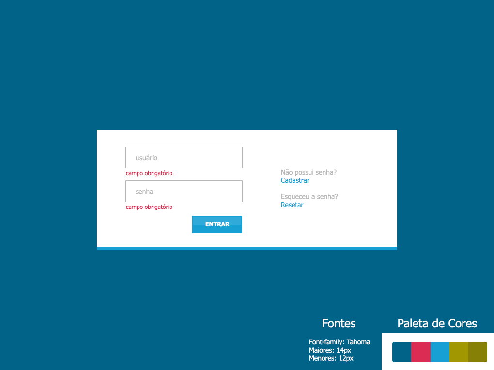

# desafio - dev front-end #

Este desafio tem como objetivo fomentar desenvolvedores e ajudar empresas a desenvolver desafios para contração de novos devs.

**PASSOS**

1. Validar campos "usuário" e "senha" como obrigatórios (Apenas habilitar botão "Entrar" quando preenchidos).
2. Ao digitar o usuário "paraibajs" e a senha "123%$" o usuário deverá exibir os dados digitados no console do navegador ser direcionado para a próxima página (Utilizar rotas como: @angular/router, react-route, etc).
3. A próxima página deverá consumir dados(HttpClient, Axios, etc) da API(URL no final) e apresentar na sequência:
* nome completo (firstname + lastname)
* email
* picture
4. Utilize a criatividade(coisa simples) para criar um layout para essa segunda página.

**REQUISITOS**

* Utilizar algum framework/library like React, Angular, etc.
* Se preferir fazer com Vanilla JS, sinta-se à vontade.

**DIFERENCIAL**
* Seguir padrões do ES6 (let, const, arrow function, etc).
* Implementar testes (Jasmine, Karma, JEST, etc) e TDD.

***OBS***
* Pode utilizar frameworks CSS like Bootstrap, Foundation, etc.
* Pode utilizar pré-processadores CSS like SASS, LESS, Stylus, etc.

### API: ###
https://randomuser.me/api/?inc=name,email,picture